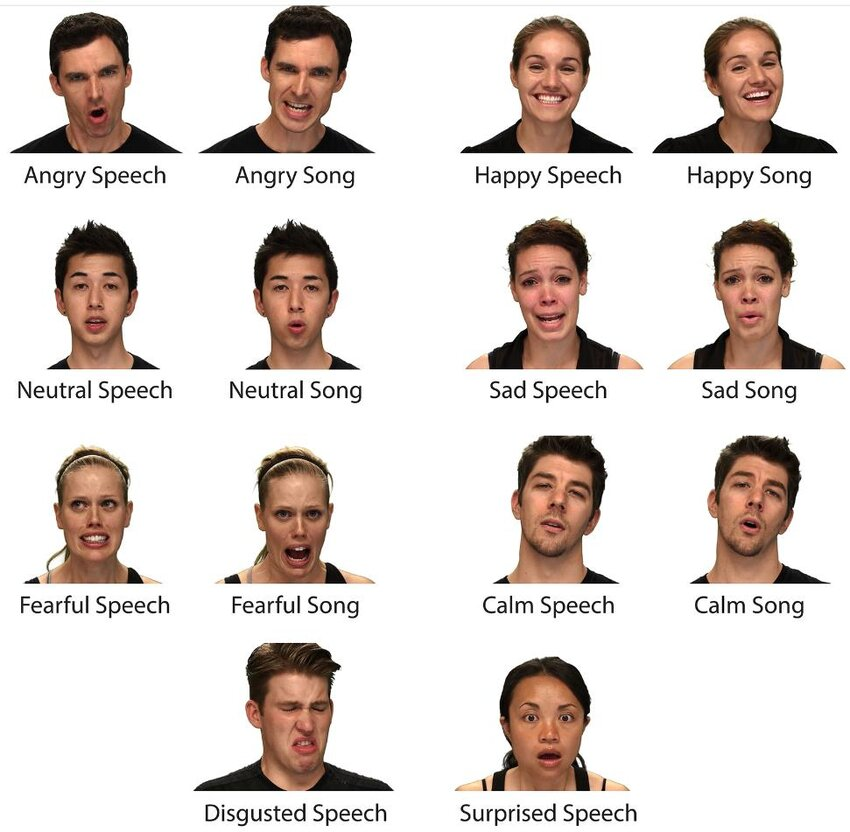

# Data Mining and Analysis of Vocal Emotions for Advanced Classification and Time-Series Analysis


## Overview
This repository presents an advanced data mining project conducted as part of the Master's Degree in Data Science and Business Informatics at the University of Pisa. The project extends the analysis of the Ryerson Audio-Visual Database of Emotional Speech and Song (RAVDESS) dataset, focusing on sophisticated techniques for binary and multi-class classification, regression, time-series analysis, and explainable AI (XAI). The goal is to enhance emotion recognition through feature selection, outlier detection, handling imbalanced data, and time-series pattern discovery, contributing to applications in audio-based emotion recognition, human-computer interaction, and sentiment analysis.

---

## Problem Statement
The core objective is to analyze vocal emotion data to build robust predictive models and uncover temporal patterns, addressing challenges like high-dimensionality, class imbalance, and interpretability. The project is divided into four modules, each tackling specific focus areas:

1. **Binary Classification**: Predict emotional intensity (normal vs. strong) using K-Nearest Neighbors (KNN) and Decision Tree (DT) classifiers, optimizing performance through feature selection, outlier detection, and imbalance handling.
2. **Advanced Classification**: Perform multi-class emotion classification (8 emotions) using Logistic Regression, Neural Networks (NN), Support Vector Machines (SVM), and ensemble methods (Bagging, AdaBoost, Gradient Boosting Machine, Random Forest).
3. **Regression and Time-Series Analysis**: Predict continuous audio features (e.g., standard deviation as a proxy for intensity) and identify motifs and anomalies in audio time-series data.
4. **Explainable AI**: Enhance model interpretability using Decision Trees and LIME to explain Neural Network predictions.

The project aims to provide a comprehensive framework for emotion recognition, leveraging advanced data mining and time-series techniques to improve model performance and interpretability.

---

## Dataset
The RAVDESS dataset consists of 2452 audio recordings from 24 professional actors (12 male, 12 female) expressing emotions in a neutral North American accent. The dataset is available [here](https://drive.google.com/drive/folders/1Azcy3wH9dOLdoYisXC3PgyQBDRM42ydY?usp=drive_link) and is processed into two formats:

- **Tabular Dataset**: Used for classification and regression, with 1828 training and 624 test instances, each with 434 features, including:
  - **Categorical Attributes**: Modality (audio-only), vocal channel (speech or song), emotion (angry, calm, disgust, fearful, happy, neutral, sad, surprised), emotional intensity (normal, strong), statement ("Kids are talking by the door" or "Dogs are sitting by the door"), repetition, actor, sex, filename.
  - **Numerical Attributes**: 425 features derived from audio signals and transformations (Zero Crossing Rate, Mel-Frequency Cepstral Coefficients (MFCC), Spectral Centroid (SC), STFT Chromagram, Lag1), with statistics (sum, mean, std, min, max, kurtosis, skewness) computed across the waveform and quantiles.
- **Time-Series Dataset**: Used for Module 4, consisting of raw audio files converted to NumPy arrays, padded/truncated to a uniform length of 304,304 samples, with extracted features (MFCC, chroma, spectral contrast, tonnetz, zero-crossing rate, pitch).

---

## Project Structure

The repository contains the following files directly under the `Data_Mining_2/` directory:

- **`Clustering.ipynb`**:
  - A Jupyter notebook focused on clustering techniques applied to the RAVDESS dataset, such as K-means, DBSCAN, or hierarchical clustering, to identify patterns in vocal emotions.

- **`DATA_MINING_2_REPORT_FINAL.pdf`**:
  - The comprehensive project report detailing the methodologies, results, discussions, and visualizations for advanced classification, time-series analysis, and other data mining techniques applied to vocal emotion recognition.

- **`Ensemble_Methods.ipynb`**:
  - A Jupyter notebook implementing ensemble classification methods (e.g., Random Forest, Gradient Boosting, or stacking) to predict vocal emotions or channels in the RAVDESS dataset.

- **`Outliers_Removal.ipynb`**:
  - A Jupyter notebook dedicated to outlier detection and removal techniques, ensuring robust data preprocessing for the RAVDESS dataset.

- **`RAVDESS-Dataset.png`**:
  - An image file visualizing or representing the RAVDESS dataset, used in the project documentation to illustrate dataset characteristics.

- **`README.md`**:
  - The main README file providing an overview of the DM-2 project, problem statement, dataset details, analysis phases, key findings, tools, and usage instructions.

- **`SVM_Classification.ipynb`**:
  - A Jupyter notebook implementing Support Vector Machine (SVM) classification to predict vocal emotions or channels, including model training and evaluation.

- **`functions.py`**:
  - A Python script containing reusable functions for data preprocessing, feature engineering, and analysis tasks used across the project's notebooks.

---

## Analysis and Insights
The project is structured into four analytical modules, each leveraging advanced data mining techniques:

### Module 1: Binary Classification
- **Task**: Predict emotional intensity (normal vs. strong) using KNN and DT classifiers.
- **Preprocessing**:
  - Applied min-max normalization to continuous attributes.
  - Dropped irrelevant features (filename, modality, actor) and 51 single-value features.
  - One-hot encoded emotions and binarized other categorical variables.
- **Feature Selection**:
  - Removed highly correlated features (thresholds: 0.7–0.99), but performance dropped (best validation accuracy: 0.726 at 0.99).
  - Removed low-variance features (thresholds: 0.001–0.1), with slight improvement at 0.001 (validation accuracy: 0.750).
  - Recursive Feature Elimination (RFE) with Random Forest selected 50 features, achieving the best KNN validation accuracy (0.781).
- **Outlier Detection**:
  - **Local Outlier Factor (LOF)**: Marginal impact on KNN (test accuracy: 0.766 with no outliers), but DT improved by 3% with 5% outliers removed (test accuracy: 0.738).
  - **Isolation Forest (IF)**: No significant improvement (best test accuracy: 0.766 for KNN, 0.708 for DT).
  - **Angle-Based Outlier Detection (ABOD)**: DT improved by 4% with 10% outliers removed (test accuracy: 0.745).
  - **Lightweight On-line Detector of Anomalies (LODA)**: DT improved by 2% with 10% outliers removed (test accuracy: 0.721).
- **Unbalanced Classification**:
  - Reduced positive class to 4% of training data.
  - **Random Undersampling**: KNN achieved balanced accuracy (BA) of 0.67, outperforming DT (BA: 0.63).
  - **Random Oversampling**: Worse performance (KNN BA: 0.57, DT BA: 0.55).
  - **Condensed Nearest Neighbor (CNN)**: DT achieved BA of 0.666, with balanced recall.
  - **SMOTE**: Best for KNN (BA: 0.68), but poor for DT.
  - **Isolation Forest**: Poor performance (BA: 0.550).
- **Key Insights**: KNN was resilient to outliers, while DT benefited from outlier removal (ABOD best). SMOTE enhanced KNN performance in imbalanced settings, and RFE significantly improved feature selection.

### Module 2: Advanced Classification
- **Task**: Classify 8 emotions using 379 features (post-preprocessing for DT).
- **Algorithms**:
  - **Logistic Regression**: L1 regularization with C=4.64 achieved test accuracy of 0.52, struggling with sad emotions (F1-score: 0.31).
  - **Neural Network (NN)**: Keras-based feed-forward NN with tanh activation, L1 regularization, and early stopping achieved test accuracy of 0.52, with better sad emotion performance (F1-score: 0.37).
  - **SVM**: Non-linear kernel (RBF, C=1) achieved test accuracy of 0.51, linear kernel 0.48, struggling with happy and sad emotions.
  - **Bagging**: Achieved test accuracy of 0.50, with overfitting reduced as training size increased.
  - **AdaBoost**: Poor performance (test accuracy: 0.42), struggling with neutral, disgust, and happy emotions.
  - **Gradient Boosting Machine (GBM)**: Achieved test accuracy of 0.516, with top features including categorical and numerical attributes.
  - **Random Forest**: Test accuracy of 0.471, with numerical features dominating importance.
- **Key Insights**: Logistic, NN, and GBM performed best (accuracy: 0.52), with sad, fearful, and happy emotions consistently challenging across models. NN had balanced ROC curves.

### Module 3: Regression and Time-Series Analysis
- **Regression**:
  - **Task**: Predict standard deviation (std) as a proxy for intensity.
  - **Preprocessing**: Removed features with >0.5 correlation with std, resulting in 316 features.
  - **Linear Regression**: Benchmark with R²=0.8477, RMSE=0.0577, MAE=0.03738.
  - **Random Forest**: Poor performance (R²=0.7572, RMSE=0.0729, MAE=0.0418), with top features including angry emotion and MFCC.
  - **Neural Network**: Best performance (R²=0.9672, RMSE=0.02679, MAE=0.0167) with smooth learning curve and no overfitting.
- **Time-Series Analysis**:
  - **Preprocessing**: Converted audio files to NumPy arrays, padded/truncated to 304,304 samples, and extracted features (MFCC, chroma, etc.).
  - **Motif and Anomaly Discovery**:
    - Used STOMP (Stumpy) with a 50-sample window to compute matrix profiles.
    - Identified 4 motifs (recurrent patterns in high-intensity vowel sections) and 3 anomalies (random noise in low-intensity pauses).
    - SAX analysis revealed common motifs: descending/ascending patterns in speech (fearful, strong) and oscillatory patterns in songs.
  - **Clustering**:
    - **Feature-Based**: K-means with 3 clusters (silhouette score: 0.53), driven by sex and emotions (angry, happy).
    - **Distance-Based**: K-means with DTW on compressed time-series (100 segments), forming 3 clusters, with the largest cluster containing calm, sad, disgust, and neutral emotions.
  - **Classification**:
    - **KNN with DTW**: Poor performance (test accuracy: 0.37–0.38), improved with zero-region removal but struggled with disgust.
    - **Mini ROCKET**: Best performance (test accuracy: 0.57, BA: 0.57) with 10,000 kernels and Ridge regression.
    - **Shapelets**: Random Forest on shapelet distances achieved test accuracy of 0.40, with two-wave patterns similar to SAX motifs.
- **Key Insights**: NN outperformed in regression due to correlated features. Mini ROCKET excelled in time-series classification. Motifs reflected speech vs. song differences.

### Module 4: Explainable AI
- **Decision Tree Visualization**: Trained a DT (depth=4) on NN predictions, revealing `lag1_min_w3` as a key splitter for sad-calm vs. angry-fearful emotions.
- **LIME**: Applied to two correctly classified NN predictions, showing categorical features (emotional intensity, sex) as dominant, with vocal channel occasionally misleading.
- **Key Insights**: XAI techniques clarified NN decisions, highlighting categorical feature influence and potential biases.

---

## Key Findings
- **Binary Classification**: KNN was robust to outliers, while DT improved with ABOD (test accuracy: 0.745). SMOTE enhanced KNN in imbalanced settings (BA: 0.68).
- **Multi-Class Classification**: Logistic, NN, and GBM achieved the highest accuracy (0.52), with sad, fearful, and happy emotions consistently challenging.
- **Regression**: NN excelled in predicting std (R²=0.9672), leveraging correlated audio features.
- **Time-Series Analysis**: Mini ROCKET outperformed other classifiers (accuracy: 0.57). Motifs distinguished speech (sudden intensity changes) from songs (oscillatory patterns).
- **Explainability**: XAI revealed categorical feature dominance in NN predictions, aiding bias detection.

---

## Tools and Technologies
- **Programming Language**: Python
- **Libraries**: Pandas, NumPy, Scikit-learn, Matplotlib, Seaborn, Imblearn, Keras, TensorFlow, Tslearn, Stumpy, Pyts, PYOD, LIME
- **Techniques**: Feature selection (RFE, correlation, variance), outlier detection (LOF, IF, ABOD, LODA), imbalanced learning (SMOTE, CNN, random sampling), classification (KNN, DT, Logistic, NN, SVM, ensemble methods), regression (Linear, RF, NN), time-series analysis (STOMP, SAX, DTW, Mini ROCKET, shapelets), XAI (Decision Trees, LIME)

---

## How to Use
1. Clone the repository:
   ```bash
   git clone https://github.com/Mohamed-Arafaath/Data-Mining-DM2.git
   ```
2. Navigate to the `code/` folder and run the main script: DM-1 Project File.ipynb
3. Access the dataset via the [Google Drive](https://drive.google.com/drive/folders/1eDnSO5X8qNK-xKx6_wGMr-1ueQ1gyZeG?usp=drive_link).
4. Explore visualizations and the project report in the `visualizations/` and `report/` folders.
---

## 📧 Contact

For any questions or feedback, feel free to reach out:

- **Author**: [Mohamed Arafaath](https://www.linkedin.com/in/mohamed-arafaath/)
- **Email**: mohamed_arafaath@outlook.com
